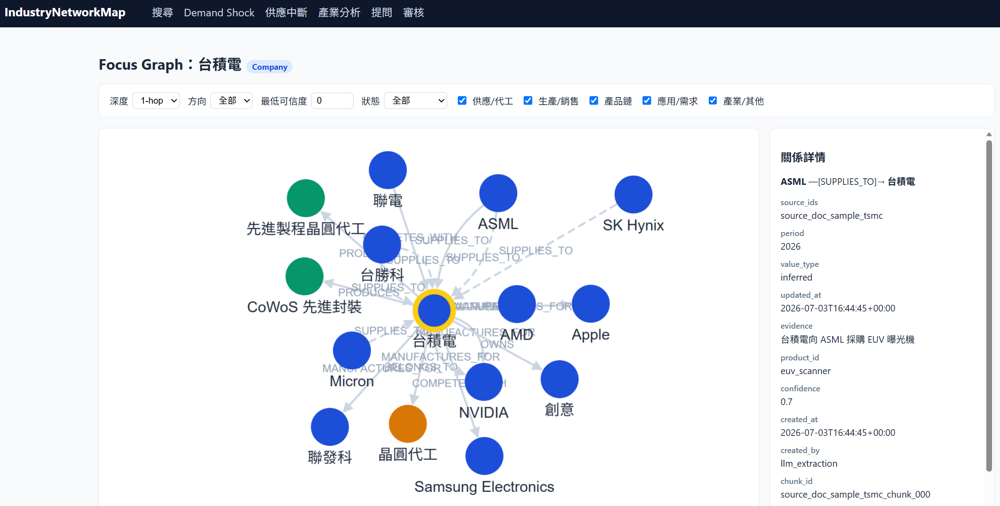
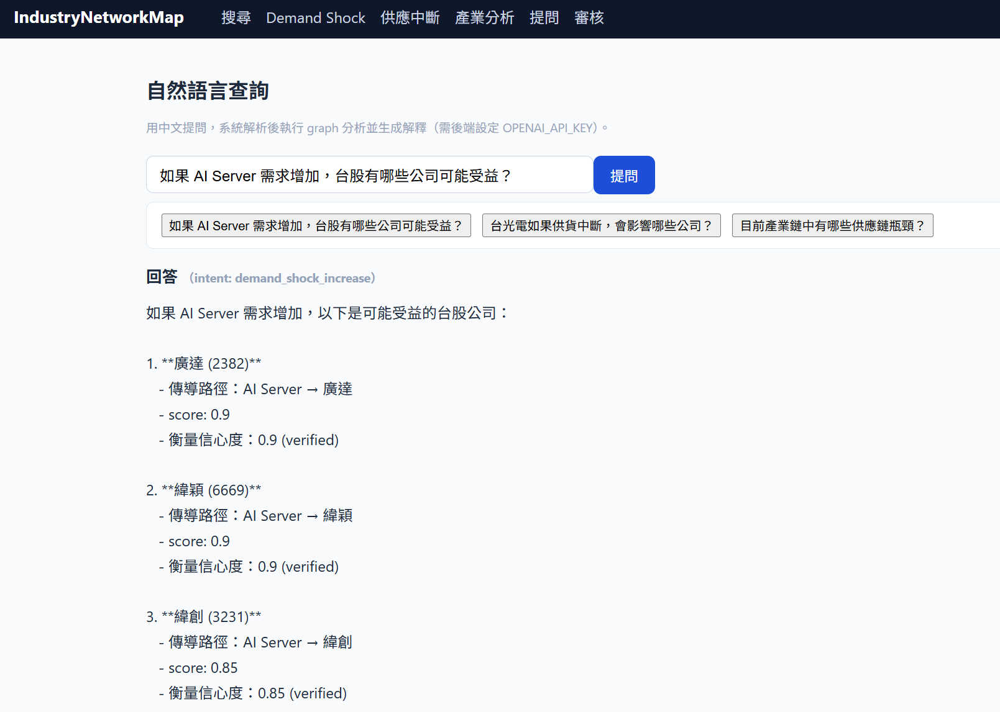

# IndustryNetworkMap

## Data Enrichment Workflow

To expand the graph with Taiwan top 100 companies, large US companies, official filings, and a shared progress table, use:

- Workflow: [docs/development/company-data-enrichment-workflow.md](docs/development/company-data-enrichment-workflow.md)
- Progress table: [ingestion/progress/company_update_progress.csv](ingestion/progress/company_update_progress.csv)
- US universe: [ingestion/seeds/universe_us_large_cap.csv](ingestion/seeds/universe_us_large_cap.csv)

Refresh the reusable company universe and official source pointers:

```powershell
python ingestion/scripts/refresh_company_universe.py --write
python ingestion/validators/validate.py ingestion/seeds
python ingestion/scripts/import_graph.py --seeds ingestion/seeds
```

Download, parse, and index official documents for RAG search/extraction:

```powershell
python ingestion/scripts/sync_sources_to_rag_manifest.py
python ingestion/rag/parse_documents.py
python ingestion/rag/build_index.py --batch-size 32
```

RAG/LLM features require `OPENAI_API_KEY` in `.env`.
台股產業鏈知識圖譜 Web App。以 graph 為基礎的產業鏈研究工具：公司、產品、產業、應用是節點，供應 / 代工 / 生產 / 需求驅動等有方向的關係是邊，每條邊都可追蹤來源與可信度。





## 功能

- **產業鏈 Focus Graph**：以任一公司 / 產品為中心，互動探索上下游關係（深度、方向、關係類型、可信度篩選）
- **Demand Shock 分析**：某產品或應用需求增減時，沿產業鏈找出受益 / 受害公司與傳導路徑
- **供應中斷分析**：某公司或產品斷供時的下游影響，並標示是否有替代來源
- **產業分析**：關鍵節點、供應鏈瓶頸、供應商 / 客戶集中度
- **自然語言查詢**：中文提問，LLM 解析後執行 graph 分析並生成有憑據的解釋
- **RAG 資料抽取**：從年報等文件半自動抽取供應鏈關係，經人工審核後入庫

## Quick Start

PowerShell one-command startup:

```powershell
powershell -ExecutionPolicy Bypass -File C:\Users\Bacon\Documents\python\IndustryNetworkMap\scripts\start-dev.ps1
```

This starts Neo4j, validates/imports seed data, opens backend and frontend dev-server windows, then opens:

- Web app: http://localhost:3000
- Backend API: http://localhost:8000
- Neo4j Browser: http://localhost:7474

Useful options:

```powershell
.\scripts\start-dev.ps1 -SkipInstall   # reuse installed Python/npm dependencies
.\scripts\start-dev.ps1 -SkipImport    # skip seed validation/import
.\scripts\start-dev.ps1 -NoOpen        # do not open browser automatically
```

## 手動開始

```bash
# 1. Neo4j
cd infra && docker compose up -d

# 2. 匯入資料
cd ../ingestion && pip install -r requirements.txt
python scripts/import_graph.py

# 3. Backend
cd ../backend && pip install -r requirements.txt
python -m uvicorn app.main:app --port 8000

# 4. Frontend
cd ../frontend && npm install && npm run dev
```

開啟 http://localhost:3000 。自然語言查詢與 RAG 抽取需在根目錄 `.env` 設定 `OPENAI_API_KEY`（選用）。

詳細操作見 [docs/usage.md](docs/usage.md)。

## 架構

```text
Next.js + Cytoscape.js  (frontend, :3000)
        ↓
FastAPI                 (backend, :8000)
        ↓
Neo4j                   (graph database, :7687)
        ↑
Python ingestion        (seed CSV / RAG 抽取 → 驗證 → 匯入)
```

## 文件

| 文件 | 內容 |
|---|---|
| [新增與更新公司資料指南.md](新增與更新公司資料指南.md) | 手邊有財報時，怎麼新增全新公司 / 更新已登記公司的供應鏈資料 |
| [docs/usage.md](docs/usage.md) | 安裝、啟動與各功能操作說明 |
| [docs/development/data-model.md](docs/development/data-model.md) | 節點 / 關係 schema、confidence 與 status 規則 |
| [docs/development/relationship-types.md](docs/development/relationship-types.md) | 關係類型白名單與方向慣例 |
| [docs/development/data-update-rules.md](docs/development/data-update-rules.md) | 資料更新與歷史追蹤規則 |
| [docs/development/roadmap.md](docs/development/roadmap.md) | 開發進度與待辦 |
| [docs/development/agent-development-rules.md](docs/development/agent-development-rules.md) | AI 協作開發準則 |

## 資料原則

1. 每條關係必附 confidence、status、來源；允許 unknown，禁止假精確。
2. 禁止模糊關係（RELATED_TO 等）；關係必須有明確方向與語意。
3. LLM 產出一律是 candidate，經人工審核才進 verified graph。
4. Graph 可由 seed CSV 完整重建。
